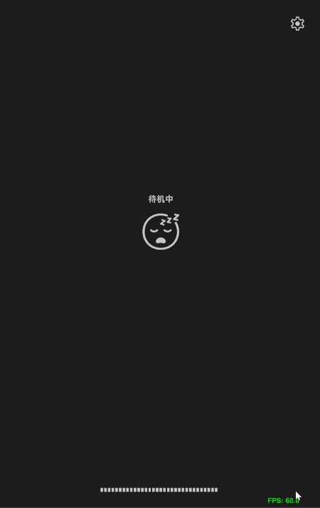
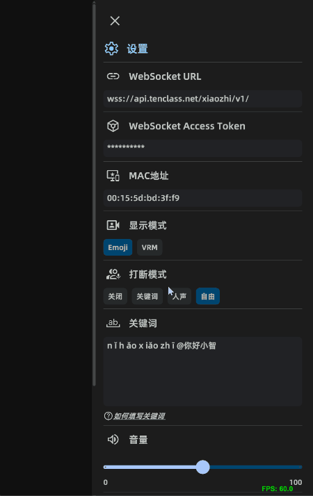

# xiaozhi-unity

基于虾哥的[xiaozhi-esp32](https://github.com/78/xiaozhi-esp32)项目的Unity版本。

## 主要功能

- 小智语音聊天
- 表现模式：
  - Emoji表情
  - VRM模型
- 语音打断模式：
  - 关键词
  - 人声 (VAD触发后立刻打断，延时1s后进入聆听模式)
  - 自由 (VAD触发后立刻打断并进入聆听模式)
- 两种主题切换
- 提供自定义配置

## 支持平台

- Windows x86_64
- Android: API level 22+ (Android 5.1+)
- 其余平台开发中

## 如何实现

- 使用FMOD进行音频录制和播放
- 集成WebRTC APM模块进行音频前处理，支持回声消除，噪声抑制，音频增强
- 集成sherpa-onnx进行实时语音识别，包括VAD和Keyword Spot检测
- 集成VRM1.0
- 使用uLipSync实现口型同步

## Reference

- [xiaozhi-esp32](https://github.com/78/xiaozhi-esp32)
- [FMOD](https://github.com/fmod/fmod-for-unity)
- [webrtc audio processing](https://gitlab.freedesktop.org/pulseaudio/webrtc-audio-processing)
- [sherpa-onnx](https://github.com/k2-fsa/sherpa-onnx)
- [uLipSync](https://github.com/hecomi/uLipSync)
- [UniVRM](https://github.com/vrm-c/UniVRM)
- [模型资源](https://hub.vroid.com/en/characters/1245908975744054638/models/2140572620978697176)